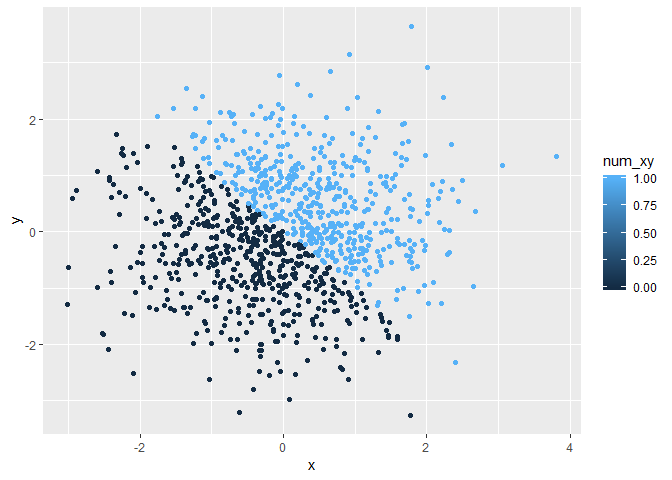
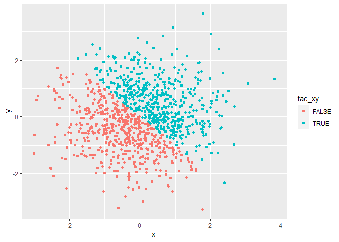

p8105\_hw1\_as5457
================
Sunny Siddique
September 18, 2018

------------------------------------------------------------------------

Problem 1
=========

**Create a data frame comprised of:**

-   A random sample of size 10 from a uniform\[0, 5\] distribution
-   A logical vector indicating whether elements of the sample are greater than 2
-   A (length-10) character vector
-   A (length-10) factor vector

``` r
#Loading the relevant package
library (tidyverse)
```

    ## -- Attaching packages ----------------------------------------------------------- tidyverse 1.2.1 --

    ## v ggplot2 3.0.0     v purrr   0.2.5
    ## v tibble  1.4.2     v dplyr   0.7.6
    ## v tidyr   0.8.1     v stringr 1.3.1
    ## v readr   1.1.1     v forcats 0.3.0

    ## -- Conflicts -------------------------------------------------------------- tidyverse_conflicts() --
    ## x dplyr::filter() masks stats::filter()
    ## x dplyr::lag()    masks stats::lag()

``` r
#Setting the seed to ensure we get the same data every time we run the code
set.seed(1)

#Creating a data frame called "prob1_df" that contains the variables specified in the prompt.

prob1_df = tibble(
  rand_samp = runif(10, min = 0, max = 5),
  vector_logical = rand_samp > 2,
  vector_char = c('Hi', 'my', 'name', 'is', 'Sunny', 'and', 'I', 'love', 'chicken', 'wings'),
  vector_factor = factor(c('male', 'male', 'male', 'male', 'male', 'female', 'female', 'female', 'female', 'female'))
)

#In the data frame above:
  #rand_samp is a random sample of size 10 from a uniform[0, 5] distribution.
  #vector_logical is indicating whether elements of the sample are greater than 2.
  #vector_char is a 10 word long character variable.
  #vector_factor is a variable containing 10 entries of the a factor variable, male or female. 
```

**Try to take the mean of each variable in your dataframe. What works and what doesn’t? Why?**

``` r
set.seed(1)

#The mean of the random sample is 2.76.
mean(prob1_df[["rand_samp"]])
```

    ## [1] 2.757569

``` r
#The mean of the logical vector is 0.60.
mean(prob1_df[["vector_logical"]])
```

    ## [1] 0.6

``` r
#Unable to compute the mean of the character vector because it's not numeric or logical.
mean(prob1_df[["vector_char"]])
```

    ## Warning in mean.default(prob1_df[["vector_char"]]): argument is not numeric
    ## or logical: returning NA

    ## [1] NA

``` r
#Unable to compute the mean of the factor vector because it's not numeric or logical.
mean(prob1_df[["vector_factor"]])
```

    ## Warning in mean.default(prob1_df[["vector_factor"]]): argument is not
    ## numeric or logical: returning NA

    ## [1] NA

When taking the means of the variables, I was able to retrieve means of the random sample and logical vector. The character and factor vectors did not retrieve means because the mean function in R only takes the mean of numeric and logical vectors.

**Write a code chunk that applies the as.numeric function to the logical, character, and factor variables (please show this chunk but not the output). What happens?**

``` r
#Converting the logical vector to a numeric vector.
as.numeric(prob1_df[["vector_logical"]])

#Converting the character vector to a numeric vector.
as.numeric(prob1_df[["vector_char"]])

#Converting the factor vector to a numeric vector.
as.numeric(prob1_df[["vector_factor"]])
```

-   When the logical vector was coerced into being numeric, the numeric conversion led to values that were false (&lt;2) to be assigned a value of 0 and values that were true (&gt;2) to be assigned a value of 1.
-   When the character vector was coerced into being numeric, the numeric conversion failed.
-   When the factor vector was coereced into being numeric, the conversion led to males being assigned a value of 2 and females being assigned a value of 1.

**In a second code chunk convert your character variable from character to factor to numeric; similarly, convert your factor variable from factor to character to numeric. What happens?**

``` r
#Converting the character variable to factor to numeric.
as.numeric(as.factor(prob1_df[["vector_char"]]))
```

    ##  [1]  3  7  8  5  9  1  4  6  2 10

``` r
#Converting the factor variable to character to numeric.
as.numeric(as.character(prob1_df[["vector_factor"]]))
```

    ## Warning: NAs introduced by coercion

    ##  [1] NA NA NA NA NA NA NA NA NA NA

-   When we converted the character variable to factor to numeric, each character variable was assigned a new number.
-   When we converted the factor variable to character to numeric, the conversion failed because as seen previously, R is unable to convert character variables to numeric.

------------------------------------------------------------------------

Problem 2
=========

**Create a data frame comprised of:**

-   x: a random sample of size 1000 from a standard Normal distribution
-   y: a random sample of size 1000 from a standard Normal distribution
-   A logical vector indicating whether the x + y &gt; 0
-   A numeric vector created by coercing the above logical vector
-   A factor vector created by coercing the above logical vector

``` r
#Setting the seed to ensure reproducibility
set.seed (1)

#Creating data frame called prob2_df with the attributes specified in the prompt
prob2_df = tibble(
  x = rnorm (1000, mean = 0, sd = 1),
  y = rnorm (1000, mean = 0, sd = 1),
  logic_xy = (x + y > 0)
)

prob2_df$num_xy = as.numeric(prob2_df[["logic_xy"]])
prob2_df$fac_xy = as.factor(prob2_df[["logic_xy"]])

#In the data frame above:
  #x and y are random samples of size 1000 from N(0,1).
  #logic_xy is a logical vector indicating whether the x + y > 0.
  #num_xy is a numeric vector created by coercing the logic vector into numeric.
  #fac_xy is a factor vector created by coercing the logic vector to factor.
```

**Write a short description of your vector using inline R code, including: the size of the dataset, the mean and median of x, the proportion of cases for which the logical vector is true.**

The number of rows in this data frame is 1000 and the number of columns in this data frame is 5. The mean of the variable x is -0.0116481 and median of variable x is -0.0353242. The proportion of cases for which the logical vector is true is 0.49.

**Make a scatterplot of y vs x; color points using the logical variable (adding color = ... inside of aes in your ggplot code should help).**

``` r
#Loading the ggplot2 package
library(ggplot2)

#Creating the first scatterplot and calling it scatter_logic
scatter_logic = ggplot(prob2_df, aes(x = x, y = y, color= logic_xy)) + geom_point()
#viewing the scatterplot
scatter_logic
```


The scatterplot produced using the logic variable has two colors because we have two distinct values in our logic variable (true/false).

**Make a second and third scatterplot that color points using the numeric and factor variables, respectively, and comment on the color scales.**

``` r
#creating the second scatterplot and calling it scatter_numeric
scatter_numeric = ggplot(prob2_df, aes(x = x, y = y, color= num_xy)) + geom_point()
#viewing the scatterplot
scatter_numeric
```



The scatterplot produced using the numeric variable led to a range of colors being assigned to the color scheme in the scatterplot. This is because the numeric variable is continuous. The reason why we only see two colors in our plot is because our numeric variable only has two values (0 or 1).

``` r
#creating the third scatterplot and calling it scatter_factor
scatter_factor = ggplot(prob2_df, aes(x = x, y = y, color= fac_xy)) + geom_point()
#viewing the scatterplot
scatter_factor
```



The scatterplot produced using the factor variable has two colors for the two values (true/false). This is similar to the scatterplot produced using the logic variable.

**Export your first scatterplot to your project directory using ggsave.**

``` r
ggsave("scatter_plot.pdf", plot = scatter_logic)
```

    ## Saving 7 x 5 in image
